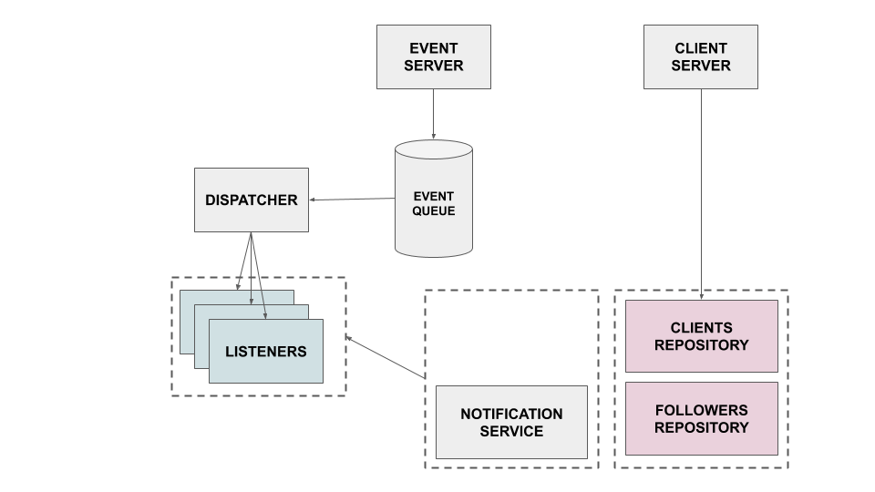

# Follower Maze - #1

## Design

Most of the work I made is about:

1. Separating concerns
2. Implement pub / sub pattern

Of course, I first wanted to use Akka Actor and Akka Stream to implement a full stateless, immutable and very scalable app. But I miss of time & knowledge. Therefore, I've built a simple listener pub/sub pattern by my own. 

I created some abstractions to split responsibilities between:

- Persistence Layer: `Repository`
- Logic Layer: `Listener` & `Service`
- Pub / sub system: `Dispatcher`
- Socket Server: `Server`

This separation make easier testability, maintainability.

More details

### Events

Message received from event source clients are parsed into `case class`. Each message has his own case class that inherits from `Event`.

### EventQueue

An event queue is faked with a thread-safe `ConcurrentHashMap` that we use to store event in memory

### Listeners

Each listener subscribes to one type of events.
It encapsulates your business logic inside `process(event: Event)`. 
Its uses others services and repositories to do the job.

⚠️ In production, a good practice (like with RabbitMQ) is generally to define a Queue for each consumer / type of event. 

### Services

1 service has been implemented `NotificationService`, it is used to notify messages to clients.

### Repositories

Classes that fake persistence and contains mutable state. Used to cache connected `Clients` and `Followers`.

### Dispatcher

This class is used to dispatch events according their sequence number to the all listeners. 

## Trade-off & shortcut

- As I mentioned, I was focused on concerns separation, I took a shortcut to use only one queue and manually dispatch
events to listeners. With brokers it would be better to define one queue per consumer type. 
- Better server shutdown 
- I did not use asynchronous code but it would be nice to use Future
- Improve `Main` class using injection dependency because there is a lot of manual composition there

## Top priorities production

In order to make it production ready, I would

1. Use a database instead of in-memory HashMap (redis could work well)
2. Use a real queue system (as RabbitMQ) to be able to persist event and dead letter. Without it would be
impossible to redeploy without loosing event!
3. Improve server start & shutdown  
4. Improve logging and error handling to make debugging easier
5. Add full test coverage
6. Setup staging env with E2E tests
7. Use asynchronous code
8. Add configuration system
 

 
 ## Part 2
 
 ### Overview 
 
 I have designed the DLQ to be a feature part of the `EventQueue` class. 
 From this queue, an event can be `acked` or `rejected`. If the event is `reject` it has been added
 to the dead letter queue (and logged). 
 
 - The `EventQueue` add the message to the dead letter if it can not be enqueued (malformed, ...)
 - The `Dispatcher` acks or rejects the event message based on the success of the process message. I used scala `Try` class.
 
 ### Production scenario
 
 Message in deadletters should:
 
 - Persist somewhere
 - Trigger an alert
 - Be handled by human
 - Be cleared as soon as the issue has been fixed
 